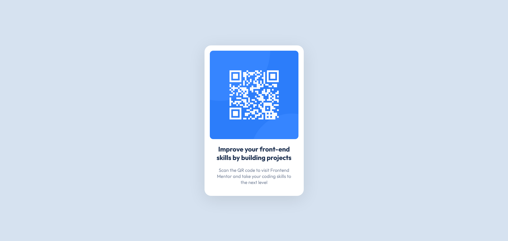

# Frontend Mentor - QR code component solution

This is a solution to the [QR code component challenge on Frontend Mentor](https://www.frontendmentor.io/challenges/qr-code-component-iux_sIO_H).

## Table of contents

- [Overview](#overview)
  - [Screenshot](#screenshot)
  - [Links](#links)
- [My process](#my-process)
  - [Built with](#built-with)
  - [What I learned](#what-i-learned)
  - [Continued development](#continued-development)
- [Author](#author)

## Overview

### Screenshot

- Desktop

  

- Mobile

  

### Links

- Solution URL: [Challenge - QR Code Component](https://lucasdiias.github.io/challenges-qr-code-component/)

## My process

### Built with

Simply:

- HTML5
- CSS3

**Note: These are just examples. Delete this note and replace the list above with your own choices**

### What I learned

Always good to remember ways to center things.

```css
body {
  display: grid;
  place-items: center;
}
```

### Continued development

I'll focus now on upgrading my css skills. Feeling a bit stuck sometimes.

## Author

- Frontend Mentor - [@LucasDiias](https://www.frontendmentor.io/profile/LucasDiias)
- Linkedin - [@LucasDiias](https://www.linkedin.com/in/lucasdiias/)
